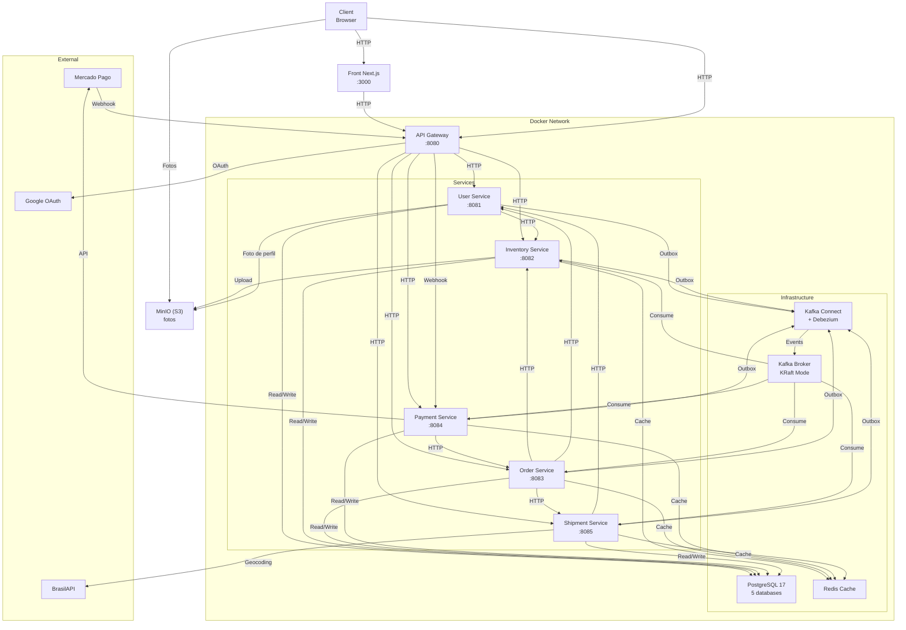
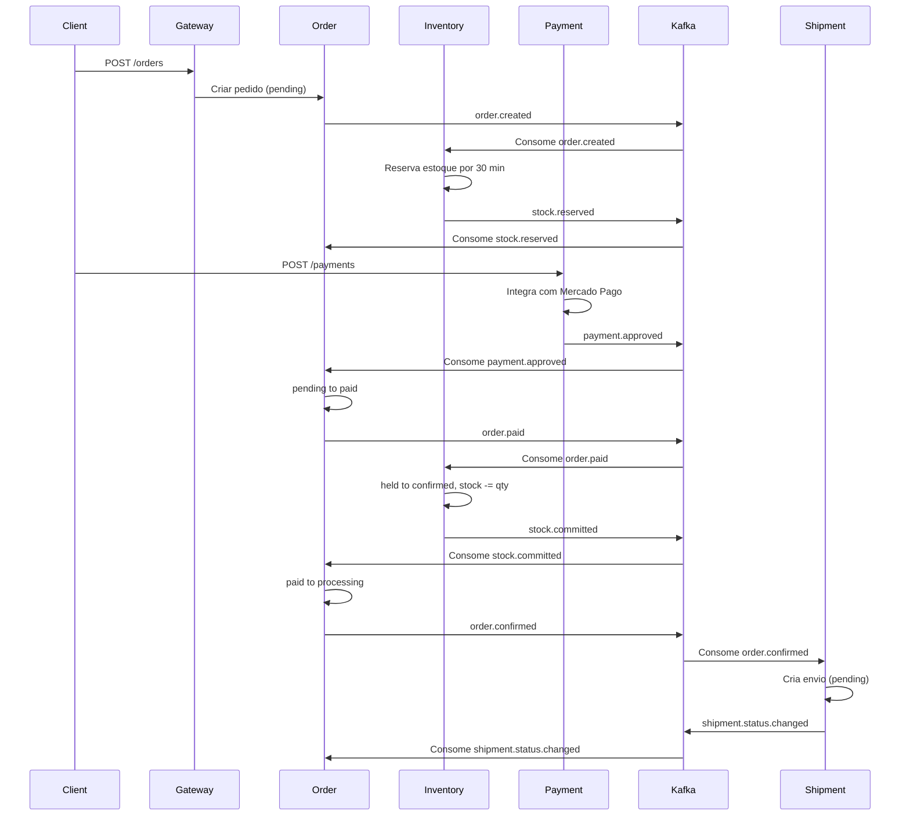

# Event-Driven E-commerce Store

[](https://github.com/TiagoAReiz/ecommerce-event-driven-spring/actions/workflows/ci.yml)

Event-driven e-commerce: six Spring Boot 4 / Java 25 microservices coordinated by an **orchestrated saga**, publishing every domain event through a **transactional outbox streamed by Debezium (CDC) into Kafka** — no dual writes, at-least-once delivery in commit order. Includes a Next.js storefront, and the whole stack comes up with a single `docker compose up`.

**Destaques:** saga com compensacao (estorno, devolucao de estoque) · outbox + Debezium Outbox Event Router nos cinco bancos · retry exponencial + DLT · checkout e pagamento idempotentes (`Idempotency-Key`) · JWT RS256 emitido pelo gateway com escopos por papel · arquitetura hexagonal (ports & adapters) em cada servico · CI com Postgres real por servico.

---

## Visão Geral

Loja virtual de varejo com microsserviços Spring Boot 4.1.1 / Java 25, orientada a eventos com Apache Kafka. Cada serviço gerencia seu próprio banco de dados PostgreSQL 17 e comunica-se via eventos através de um pipeline outbox transacional integrado com Debezium. A loja oferece apenas um proprietário e catálogo único (não marketplace), com orquestração de pedidos via saga distribuída que envolve reserva de estoque, processamento de pagamentos, gerenciamento de envios e controle de reviews.

---

## Arquitetura



---

## Serviços e Responsabilidades

| Serviço | Porta | Banco | Responsabilidades |
|---------|-------|-------|-------------------|
| **API Gateway** | 8080 | user_db | Autenticacao OAuth2, roteamento de requisicoes, validacao de tokens |
| **User** | 8081 | user_db | Gestao de usuarios, enderecos, autenticacao de servicos internos |
| **Inventory** | 8082 | inventory_db | Catalogo de produtos, reserva e controle de estoque, avaliacoes |
| **Order** | 8083 | order_db | Orquestracao de sagas, gerenciamento de pedidos, carrinho |
| **Payment** | 8084 | payment_db | Integracao Mercado Pago, processamento de pagamentos, estornos |
| **Shipment** | 8085 | shipment_db | Gestao de envios, rastreamento, entrega |
| **Front** | 3000 | — | Vitrine, conta, carrinho, pedidos e area da loja (Next.js) |
| **MinIO** | 9000 / 9001 | — | Fotos de produto (S3). 9000 e a API, 9001 o console |

---

## Saga de Checkout — Caminho Feliz



---

## Decisoes de Arquitetura

### Loja Unica
Nao ha suporte para marketplace. Um unico proprietario controla catalogo, precos e envios. Categorias sao definidas apenas por migracao (API de leitura).

### Outbox Transacional + Debezium (ADR-001)
Todos os eventos de dominio sao gravados na tabela outbox da mesma transacao que muda o estado. O Debezium le o Write-Ahead Log (WAL) em modo replicacao logica (wal_level=logical) e publica no Kafka, garantindo entrega at-least-once na ordem de commit. Nenhum servico publica com KafkaTemplate: toda publicacao passa pela outbox.

### Orquestracao Centralizada no Order
O servico order e o orquestrador unico da saga. Todo evento de outro servico termina no order, que decide o passo seguinte. Isso centraliza o estado da maquina de pedido e simplifica depuracao.

### Token JWT Interno
O gateway emite dois tipos de JWT:
- Token frontend (aud=front): usado pelo browser, trocado a cada requisicao
- Token interno (aud=internal): repassado aos microsservicos, carrega escopos baseados no papel (customer, owner, svc)

Servicos internos se autenticam com clientId + clientSecret, obtendo tokens de servico via POST /auth/service-token no gateway.

### Retry Bloqueante + Dead Letter Topic
Kafka Consumer com DefaultErrorHandler: retry exponencial (1s, x2, max 10s, total 60s) para erros transientes. Erros nao-retentaveis (desserializacao, integridade) vao direto para <topico>-dlt na mesma particao.

### Consumidores Idempotentes
A entrega e at-least-once, entao cada passo da saga tolera reentrega: reservar ou baixar o estoque de novo cai em `ALREADY_RESERVED` / `ALREADY_COMMITTED` e nao duplica efeito. A key da mensagem e o `aggregateid` da outbox (ex.: `orderId`), o que mantem os eventos de um mesmo pedido em ordem na mesma particao.

### Reserva de Estoque com Prazo
`order.created` reserva o estoque por 30 minutos (`held`). A baixa definitiva (`confirmed`) so acontece depois do pagamento aprovado; cancelamento libera a reserva, e a reserva vencida deixa de contar sozinha (sem job de limpeza).

### Checkout e Pagamento Idempotentes
`POST /orders` e `POST /payments` exigem `Idempotency-Key` (UUID). No `order` o estado fica no Redis (`IN_FLIGHT` por 60s, resultado por 24h, mesma chave com outro corpo responde `IDEMPOTENCY_KEY_REUSED`); no `payment` a chave e gravada com o pagamento e repassada ao Mercado Pago. Repetir a requisicao nao cria outro pedido nem cobra de novo. Valor e frete sao sempre calculados no servidor.

### Arquitetura Hexagonal por Servico
Cada modulo separa `application` (casos de uso e ports de entrada/saida) de `infra` (controllers, consumidores Kafka, repositorios JPA, clientes HTTP). O dominio nao conhece Kafka nem Spring Web.

### Redis como Cache Complementar
Cache de leitura para rotas de catalogo e analise de frete. Falha de Redis nao derruba nenhuma rota: loga WARN e segue para o banco.

---

## Stack Tecnologico

- Runtime: Java 25, Spring Boot 4.1.1
- Persistencia: PostgreSQL 17, JPA/Hibernate 7
- Mensageria: Apache Kafka 3.9 (KRaft), Kafka Connect, Debezium 3.1
- Armazenamento de objetos: MinIO (API S3) para fotos de produto e de perfil
- Cache: Redis 7.4-alpine
- Build: Maven
- Migrations: Flyway
- Serializacao: Jackson 3.x (ObjectMapper)
- Autenticacao: Spring Security 7, OAuth2, JWT (RS256)
- Validacao: Jakarta Bean Validation
- Cliente HTTP entre servicos: RestClient (sincrono), nao WebClient

**Front** (`front/`)

- Next.js 16 (App Router) + React 19 + TypeScript
- TanStack Query
- Tailwind CSS 4, identidade branco e azul com tokens em `src/app/globals.css`
- Vitrine publica renderizada no servidor; o que depende de sessao roda no navegador
- No compose, servidor Next em modo standalone na porta 3000

---

## Como Rodar

### Pre-requisitos

Docker e Docker Compose. Mais nada.

### 1. Subir tudo

```bash
docker compose up -d --build
```

Sobe os seis servicos, Kafka, Postgres, Redis, Debezium e a vitrine. **Nao precisa de preparo
nenhum**: sem `.env`, sem gerar chave, sem criar banco. Se as chaves de assinatura do gateway
nao existirem, o container gera um par descartavel no primeiro boot e avisa no log.

- Loja: http://localhost:3000
- Gateway: http://localhost:8080
- Console do MinIO: http://localhost:9001 (usuario e senha de `S3_ACCESS_KEY`/`S3_SECRET_KEY`)
- Conectores Debezium: chegam a RUNNING sozinhos (o `connect-init` insiste ate la)

### 2. Segredos (opcionais, cada um libera uma coisa)

| Variavel | Onde | Libera |
|---|---|---|
| `GOOGLE_CLIENT_ID`, `GOOGLE_CLIENT_SECRET` | `micro-services/api-gateway/.env` ou ambiente | o login. Sem eles a stack sobe com um marcador e o Google recusa a autorizacao |
| `STORE_OWNER_EMAIL` | `.env` na raiz ou ambiente | define quem e o dono da loja (default: `dono@loja.local`) |
| `MP_ACCESS_TOKEN`, `MP_PUBLIC_KEY` | `.env` na raiz ou ambiente | pagamento de verdade. Sem eles o `payment` roda em modo `fake`, com o fluxo inteiro funcionando |

No Google Cloud, o redirect autorizado e `http://localhost:8080/login/oauth2/code/google` — do
**gateway**, nao do front.

Os arquivos `.env` sao opcionais: `.env.example` na raiz e em `api-gateway/` mostram o formato.

### 3. Parar

```bash
docker compose down        # mantem os dados
docker compose down -v     # apaga os volumes tambem
```

### 4. Validar a Subida

```bash
# Verificar que gateway responde (JWKS e publico)
curl -s http://localhost:8080/.well-known/jwks.json

# Verificar que broker esta pronto
docker compose exec broker /opt/kafka/bin/kafka-topics.sh --list --bootstrap-server broker:9092

# Verificar que conectores estao RUNNING (o Kafka Connect nao publica porta no host)
docker compose exec connect curl -s "http://localhost:8083/connectors?expand=status"
```

### 5. Percorrer a Saga Completa

O login e feito pelo Google: nao existe senha no sistema. Abra
`http://localhost:8080/oauth2/authorization/google` no navegador; ao voltar, o token
chega no fragmento da URL (`#token=...`). Todo o resto passa pelo gateway em `/api/v1`.

```bash
TOKEN="<token do fragmento>"

# Catalogo (publico na borda)
curl -s "http://localhost:8080/api/v1/categories?includeEmpty=true"
curl -s http://localhost:8080/api/v1/products

# Carrinho
curl -s -X POST http://localhost:8080/api/v1/cart/items   -H "Authorization: Bearer $TOKEN" -H "Content-Type: application/json"   -d '{"idProduct":1,"quantity":1}'

# Checkout: o valor e o frete sao calculados no servidor, nunca aceitos do cliente
curl -s -X POST http://localhost:8080/api/v1/orders   -H "Authorization: Bearer $TOKEN" -H "Content-Type: application/json"   -H "Idempotency-Key: $(uuidgen)"   -d '{"addressId":1}'

# Pagamento PIX (sem MP_ACCESS_TOKEN o servico responde em modo fake)
curl -s -X POST http://localhost:8080/api/v1/payments   -H "Authorization: Bearer $TOKEN" -H "Content-Type: application/json"   -H "Idempotency-Key: $(uuidgen)"   -d '{"idOrder":1,"method":"pix",
       "payer":{"email":"cliente@exemplo.dev",
                "identification":{"type":"CPF","number":"12345678909"}}}'

# A partir daqui a saga corre sozinha:
# payment.approved -> pedido paid -> stock.committed -> order.confirmed -> envio criado
curl -s http://localhost:8080/api/v1/orders/1 -H "Authorization: Bearer $TOKEN"

# A loja despacha; o comprador confirma a entrega
curl -s -X PATCH http://localhost:8080/api/v1/shipments/1   -H "Authorization: Bearer $TOKEN" -H "Content-Type: application/json"   -d '{"status":"in_transit","trackingCode":"BR123456789XY"}'
curl -s -X POST http://localhost:8080/api/v1/shipments/1/confirm-delivery   -H "Authorization: Bearer $TOKEN"

# Entrega confirmada da o direito de avaliar
curl -s http://localhost:8080/api/v1/reviews/pending -H "Authorization: Bearer $TOKEN"
curl -s -X POST http://localhost:8080/api/v1/products/1/reviews   -H "Authorization: Bearer $TOKEN" -H "Content-Type: application/json"   -d '{"idOrder":1,"rate":5,"title":"Muito bom","description":"Chegou rapido."}'
```

#### 5.1 Observar os eventos no Kafka

```bash
docker compose exec broker /opt/kafka/bin/kafka-console-consumer.sh   --bootstrap-server broker:9092   --topic ecommerce.order.created.v1   --from-beginning --property print.key=true --property print.headers=true
```

A key e o `orderId` e o header `__TypeId__` traz o alias do evento (`orderCreated`): os dois
sao postos pelo Outbox Event Router do Debezium a partir das colunas da tabela `outbox`.

---

## Referencias

- Contratos de Eventos (docs/event-contracts.md) - Especificacao de todos os eventos Kafka, topicos, keys, payloads, efeitos e sagas
- Contratos de API (docs/api-contracts.md) - Especificacao de todas as rotas HTTP, corpos, parametros, codigos de resposta
- ADR-001: Outbox Transacional com Debezium (docs/outbox-debezium.md) - Decisao de arquitetura, implementacao e operacao do pipeline de publicacao
- Configuracao Kafka (docs/kafka.md) - Serializers, deserializers, consumidor, produtor, troubleshooting
- Decisoes do Projeto (docs/decisions.md) - Decisoes de produto, arquitetura, processo e as correcoes encontradas na verificacao ponta a ponta
- OpenSpec Changes (openspec/) - Uma proposta por servico/fase, com specs em delta, design e tarefas

---

## Integracao Continua

[`.github/workflows/ci.yml`](.github/workflows/ci.yml) roda um job por microsservico a cada
push e pull request, com `fail-fast: false` — o servico que quebrou aparece sozinho.

Cada job sobe um **Postgres de verdade**: os testes carregam o contexto Spring, que abre o pool
e roda o Flyway, e o schema usa `ENUM` e `jsonb` do Postgres, entao banco em memoria nao serve.
Kafka fica de fora de proposito — o listener nao bloqueia o boot, entra em retry e o contexto
sobe igual, de modo que subir um broker seria custo sem cobertura. O gateway gera um par de
chaves descartavel no job, porque as chaves de assinatura nao sao versionadas.

---

## Estado do Projeto

Backend completo e verificado com a stack de pe, nao apenas compilando.

| Area | Estado |
|---|---|
| Borda: OAuth2 Google, emissao de token, proxy, escopos por papel | Pronto |
| `user`: perfil, enderecos, provisionamento do dono da loja, exclusao de conta (LGPD) | Pronto |
| `inventory`: catalogo, estoque, reserva, baixa, devolucao, avaliacoes | Pronto |
| `order`: carrinho, checkout idempotente, consultas, cancelamento, orquestracao da saga | Pronto |
| `payment`: PIX, cartao tokenizado, Checkout Pro, webhook, estorno | Pronto (Mercado Pago em modo `fake` sem `MP_ACCESS_TOKEN`) |
| `shipment`: cotacao de frete, envio, transicoes, confirmacao de entrega | Pronto |
| Outbox transacional + Debezium nos cinco bancos | Pronto |
| 80 rotas HTTP e 15 eventos Kafka documentados e implementados | Pronto |
| Front: vitrine, conta, carrinho, pagamento, pedidos, avaliações e área da loja | Pronto |

### O que foi percorrido ponta a ponta

Com os dez containers de pe e os cinco conectores Debezium em `RUNNING`:

- **Compra completa**: carrinho -> checkout (frete calculado por CEP real) -> `order.created` ->
  reserva de estoque -> pagamento -> `payment.approved` -> pedido `paid` -> baixa de estoque ->
  `order.confirmed` -> envio criado -> despacho -> pedido `shipped` com codigo de rastreio ->
  confirmacao de entrega -> pedido `delivered` -> elegibilidade -> avaliacao com recalculo do
  rating do produto.
- **Compensacao**: cancelamento de pedido pago -> `order.refund.requested` -> estorno no
  provedor -> `payment.refunded` -> pedido `refunded`, envio `cancelled`, estoque devolvido.
- **Exclusao de conta (LGPD)**: `DELETE /users/me` -> `user.deleted` -> avaliacao anonimizada no
  `inventory` ("Usuario removido", sem foto, texto e nota preservados) e carrinho com soft
  delete no `order`. A conta da loja responde `409`: nao se apaga pela API.
- **Subida do zero**: stack derrubada com volumes e reconstruida, migrations aplicadas,
  conectores registrados e rotas publicas respondendo.

As falhas encontradas nessa verificacao, e o que ficou decidido em cada uma, estao em
[`docs/decisions.md`](docs/decisions.md).

### Limites conhecidos

- O Mercado Pago roda em modo `fake` enquanto nao houver `MP_ACCESS_TOKEN`; o contrato das rotas
  e o mapeamento de status sao os mesmos nos dois modos.
- Os testes automatizados cobrem a carga do contexto de cada servico. A verificacao funcional
  descrita acima foi feita manualmente contra a stack.
- `ETag`/`304` e moderacao de texto de avaliacao ficaram fora do escopo; nenhum fluxo depende
  deles.

---

Projeto de portfolio.
